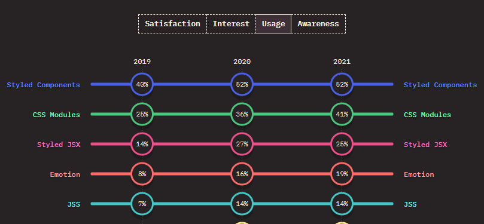
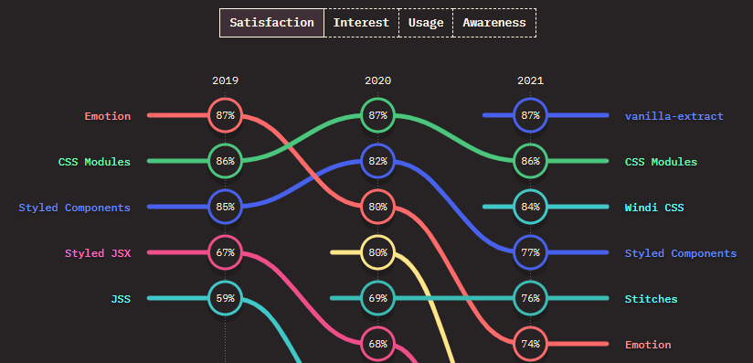

오랫동안 생각만 해두었던 리액트 토이 프로젝트 개발을 어제 시작했다. 언제나 프로젝트를 새로 시작할때는 고민이 많다. 저번 보다 더 나은 방법은 없는지 서치하고 선택하는데에만 시간이 많이 들어가는데, 고민하고 결정하는 과정들을 기록하면 좋겠다는 생각이 들어 포스팅을 작성한다.

- - -

현재 업무 프로젝트가 Vue.js로 되어있어 주로 사용하는 프론트엔드 프레임워크/라이브러리는 Vue.js 이다.

React 프로젝트는 예전에 한 스타트업 기술 과제 때문에 한번 진행해본것이 전부다.

당시 느끼기에 React는 코드 삽입 위치 등 코드 작성 방식에 대한 제약이 거의 없어서, 더 나은 방식에 대해 혼자 고민을 많이 하면서 작업을 했었다.

Vue.js는 template, script, style 등 위치가 정해져 있고, dom을 핸들링 할때 v-for, v-if 등 고유의 디렉티브라는 것을 사용하는 등 이런저런 새로운 문법과 제약이 많이 있다.

반면 React는 흰 도화지에 그림을 느려나가는 느낌이라, 같은 작업이여도 개발을 잘하는 사람과 못하는 사람의 결과물 차이가 Vue.js보다 훨씬 클 것 같다고 생각이 들었다.

아무래도 바닐라 자바스크립트의 문법이 거의 유지되다보니 코드가 좀 더 가독성이 떨어진다는 느낌도 받았었다. hook도 그렇고..

하지만 아무래도 vue보단 react를 사용하는 기업이 많기 떄문에 나의 미래를 위해 react를 잘 하는것이 도움이 되겠다는 생각이 커서 react를 한번 익혀보고싶었다.

많은 기업에서 react를 사용하고 있는 만큼 그만한 장점이 있을 것 같아서, 처음 접한 느낌은 위와 같았지만 좀 경험해보면 또 생각이 달라질 수 있지 않을까?

- - -

#### CSS 작성 방식 선택
리액트 프로젝트에선 CSS in JS 방식을 많이 봤고, 그 중 styled-components가 가장 널리 쓰이는 것 같았다.
이전 토이프로젝트에선 CSS Module을 사용했었는데 이번에는 styled components를 경험해 보고 싶어서 살짝 서치해봤다.

##### CSS in JS ?
CSS in JS 방식은 살짝 훑어봤을때, 컴포넌트 파일 안에서 자바스크립트 로직을 바로 css에 삽입할 수 있어서 굉장히 편리해 보이고 그밖에 기능이 이것 저것 많아보였다.

하지만 컴포넌트 파일을 열자마자 보이는게 css라서 마크업과 기능을 확인하려면 스크롤을 내려야 한다는게 좀 거슬렸었다.(Vue.js 프로젝트에선 style영역이 최하단에 있었기 때문에 더 어색했던걸까.) 컴포넌트를 정의하면서 스타일을 적용하다보니 상단에 위치하게 되는데 디테일한 css 내용은 하단에 정의하고 상단으로 불러들일 순 없는지 궁금하기도했다.

CSS Module과 styled components을 비교한 글들을 읽어보니 성능 차이가 꽤 있다고 한다. 

[is-styled-components-helpful-in-react](https://enlear.academy/is-styled-components-helpful-in-react-68d4a7dde49e)

[styled-components-v4-the-good-the-bad-and-something-completely-different](https://medium.com/ansarada-thinking/styled-components-v4-the-good-the-bad-and-something-completely-different-e891139e0138 )

핫 ㅎ 무려 2018년 포스팅이다. 새로운 버전이 나올수록 점점 빨라지고 있대서 좀 더 찾아봤다.

꽤 따끈한 2022년 글! 읽어보니 여전히 styled components는 성능 문제가 있긴하다. 
[카카오웹툰은 CSS를 어떻게 작성하고 있을까?](https://fe-developers.kakaoent.com/2022/220210-css-in-kakaowebtoon/)

CSS-in-JS 만족도, 사용율 등을 알려주는 사이트. Styled Components 사용율이 1등이네!

[The State of CSS 2021: CSS-in-JS](https://2021.stateofcss.com/en-US/technologies/css-in-js)
<!--  -->

만족도도 궁금해서 봐봤다.

<!--  -->

vanilla-extract? 요것이 모시당가 호기심에 살짝 봤지만 아직 익숙하지 않은 타입스크립트에 나중을 기약하며 조용히 창을 닫았다.

[vanilla-extract — Zero-runtime Stylesheets-in-TypeScript.](https://vanilla-extract.style/)

결론: 여전의 성능 이슈가 있긴 하지만 규모가 작은 프로젝트에서는 써볼만 하다고 하고, 여전히 많이 쓰이긴 하니 styled-components를 사용해보기로 한다. 가보자고!

- - -

##### 폴더 구조 정하기

아래 글들을 읽어봤다.

[How To Structure React Projects From Beginner To Advanced](https://blog.webdevsimplified.com/2022-07/react-folder-structure/)
[React Folder Structure in 5 Steps [2022]](https://www.robinwieruch.de/react-folder-structure/)

음~ 정리가 너무 잘되어있다. 프로젝트 규모가 커질때 한번 더 참고해도 도움이 될 것 같다.

마크다운에 이미지 손쉽게 삽입하기.
https://melonicedlatte.com/2022/04/09/023000.html