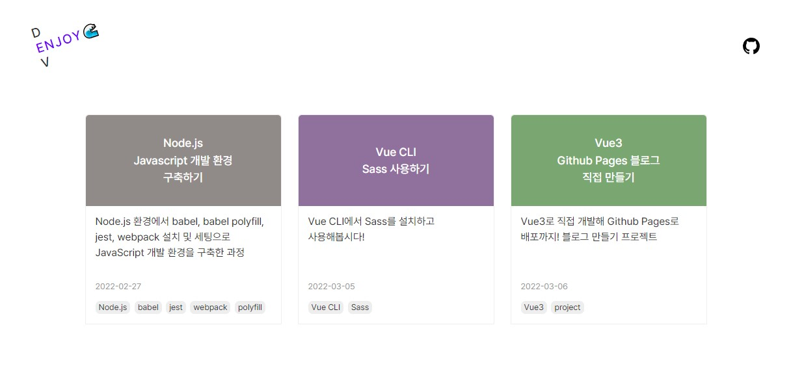
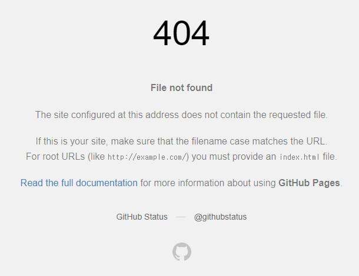
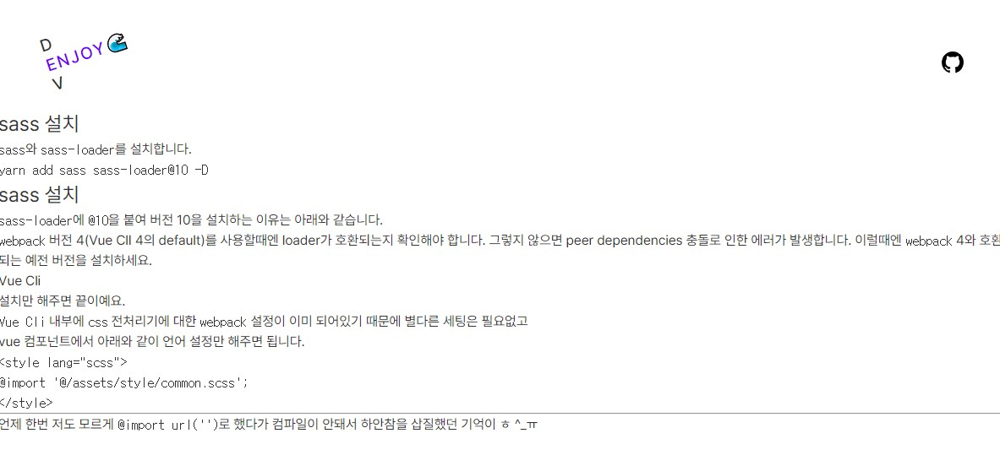

### 포스팅 리스트 만들기
지정한 폴더의 md파일 리스트를 자동으로 불러올 수 있는 방법을 알아봤다.  
<code>node.js</code>의 <code>fs</code>모듈로 파일 목록을 불러올 수 있어서 이렇게 저렇게 시도해보았는데 새로 공부할게 생각보다 훨씬 많았다. 작업이 많이 복잡한 듯 해서 우선은 파일리스트를 직접 작성하고, 파일 리스트 자동으로 가져오는 기능은 우선순위를 뒤쪽으로 뒀다.

##### 📃 src/utils/posts.js
리스트를 그릴때 사용할 포스팅에 대한 정보를 아래와 같은 형식으로 만들었다.
내용이 점점 많아질테니 컴포넌트에서 <code>import</code>할 시간을 절약하기 위해 <code>string</code>으로 변환해서 <code>export</code>했다.
``` javascript
const posts = [
  {
    'name': 'markdown-file-name',
    'title': 'title',
    'date': '2022-02-27',
    'keywords': ['keywords0', 'keywords1', 'keywords2'],
    'description': 'description',
  }
]

export default JSON.stringify(posts)
```


##### 📃 src/router/views/PostList.vue
만들어놨던 데이터를 <code>import</code>해서 <code>json</code>으로 <code>parse</code>한 후에 데이터 바인딩했다.
```html
<template>
  <div>
    <div
      v-for="(post, i) in postMap"
      :key="`post${i}`"
    >
      <a :href="post.name">
        {{ post.title }}
        {{ post.date }}
        {{ post.description }}
      </a>
      <ul>
        <li
          v-for="(keyword, keywordIndex) in post.keywords"
          :key="`keyword${keywordIndex}`"
        >
          {{ keyword }}
        </li>
      </ul>
    </div>
  </div>
</template>

<script>
import posts from '@/utils/posts'

export default {
  data() {
    return {
      postMap: []
    }
  },
  created() {
    this.postMap = JSON.parse(posts)
  },
}
</script>
```
- - -
### sass 설치 하기
스타일을 적용하기 위해 <coede>css</coede> 전처리기인 <coede>sass</coede>를 사용했다.
```
yarn add sass sass-loader@10 -D
```
자세한 과정은 [VUE CLI Sass 사용하기](vue-cli-working-with-sass) 포스팅에 정리해두었다!

- - -
### 폰트 설정
폰트는 [Github](https://github.com/)의 [Pretendard](https://github.com/orioncactus/pretendard)를 사용한다.  
웹에서 너무 부드럽게 잘 나온다. 어느 페이지든 이 폰트로 디자인의 완성도가 높아보이는 효과가 있다.  
<code>common.scss</code> 상단에 아래와 같이 font를 import하고 지정해준다.

```css
@import url('https://cdn.jsdelivr.net/gh/orioncactus/pretendard/dist/web/static/pretendard-dynamic-subset.css');

body {
  font-family: 'Pretendard';
}
```
- - -
### header 만들기
<code>header</code> 컴포넌트를 만들었다.  
로고랑 깃헙링크도 컴포넌트로 만들어서 <code>header</code> 컴포넌트 내부에 삽입해줬다.

##### 📃 /src/components/layout/Header.vue
```html
<template>
  <header>
    <h1><Logo :size="'medium'" /></h1>
    <div class="links">
      <LinkGithub />
    </div>
  </header>
</template>

<script>
import Logo from '@/components/Logo.vue'
import LinkGithub from '@/components/LinkGithub.vue'

export default {
  components: {
    Logo,
    LinkGithub
  },
  data() {
    return {
    }
  }
}
</script>

<style lang="scss" scoped>
header {
  display: flex;
  align-items: center;
  justify-content: space-between;
  padding: 50px 50px 30px;
}
nav {
  ul {
    display: flex;
    gap: 20px;
  }
}
</style>
```

로고 컴포넌트는 <code>props</code>값을 받아서 사이즈를 지정할 수 있도록했다.  
우선은 <code>header</code>에서 필요한 사이즈만 지정하고 추후 다른 사이즈가 필요하게 되면 사이즈 옵션을 추가할 예정이다.

##### 📃 src/components/Logo.vue
```html
<template>
  <a href="/" :class="`logo size-${size}`">
    <span class="logo-text dev">
      D<span class="hidden">E</span>V
    </span>
    <span class="logo-text enjoy">
      <span class="common-e">E</span>NJOY🌊
    </span>
  </a>
</template>

<script>
export default {
  props: {
    size: {
      type: String,
      default: 'medium'
    }
  }
}
</script>

<style lang="scss" scoped>
.logo {
  display: block;
  position: relative;
  font-weight: 500;
  transform: rotate(-18deg);
  &.size-medium {
    font-size: 20px;
  }

  .emoji-main {
    font-size: 50px;
  }
  .logo-text {
    &.dev {
      margin-top: -1.05em;
      margin-right: -1.1em;
      writing-mode: vertical-rl;
      text-orientation: upright;
    }
    &.enjoy {
      letter-spacing: 0.1em;
      color: rgb(111, 0, 255);
    } 
    .hidden {
      color: #fff;
    }
  }
}
</style>


```
- - -
### 배포해서 확인 해보기
포스팅을 임시로 올려놓고 배포해보았다.  
메인페이지에 리스트는 잘 나온다.

<figure>
  
  <figcaption>블로그 메인 페이지 version 1 </figcaption>
</figure>


임시로 올려놓은 포스팅을 클릭해서 상세 페이지를 들어가봤더니 404 에러가 뜬다.
아 md파일은 static파일이라 다르게 해줘야 하는건가!  
webpack loader설정을 했으면 되는거 아닌가 싶었는데..

<figure>
  
  <figcaption>404에러가 뜨고있는 포스트 상세 페이지</figcaption>
</figure>

static파일들을 public폴더로 바꿔봤다가 history mode에 대한 설정도 변경해봤다가 post관련 
구글링을 죽어라 했지만 여전히 404에러가 날 반겼다.  
생각해보니까 static 파일 import에 문제가 있는 거였으면 404가 아니라 헤더는 떴어야했다.  
그래서 라우터에 404에러에 대한 오만가지 글들을 찾아보다가 갑자기 내가 포스트 리스트에 링크를 router link로 하지않고 a태그로 했다는 사실이 생각났다.^^  
a태그를 router link로 변경하니까 너무너무 잘 나왓다.  

<figure>
  
  <figcaption>html로 잘 불러와진 마크다운 컨텐츠</figcaption>
</figure>

허무하다... 삽질의 끝이란 ㅎ  
router의 history mode의 단점인 해당 url로 바로 갔을때 404에러가 뜨는 현상은 추후 개선해봐야겠다.  

- - -
### static 파일들은 public 폴더로
위 삽질 과정에서 또 새롭게 알게되어 static파일인 md, json파일들을 public 폴더로 옮겼다.
자세한 과정은 이 포스팅에!  
[Vue CLI 4 - 마크다운 파일을 불러와 HTML로 변환하기](vue-cli-4-import-markdown-convert-to-html)  

- - -
### HTTP 호출 모듈 만들기
두 페이지에서 axios로 http요청을 하고있다.  
비슷한 코드가 반복되어 http 요청과 관련된 내용을 모듈로 만들었다.
자세한 과정은 이 포스팅에!
[Vue - HTTP 호출 모듈 만들기](vue-make-http-module) 

###### 📃 src/router/views/Main.vue 
```html
<script>
// import axios from 'axios'  // as-is
import ContainerComp from '@/components/layout/Container.vue'
import PostList from '@/components/PostList.vue'
import { importPostsInfo } from '@/utils/https' // to-be

export default {
  components: {
    ContainerComp,
    PostList
  },
  data() {
    return {
      posts: [],
      // as-is
      // baseUrl: process.env.VUE_APP_BASE_URL,
    }
  },
  created() {
    // as-is
    // axios.get(`${this.baseUrl}/posts/index.json`)
    //   .then(res => this.posts = res.data)
    //   .catch(e => console.log(`ERROR🙄 ${e.response.status} : ${e.request.responseURL}`))
    
    // to-be
    importPostsInfo()
      .then(data => this.posts = data)
  }
}
</script>
```