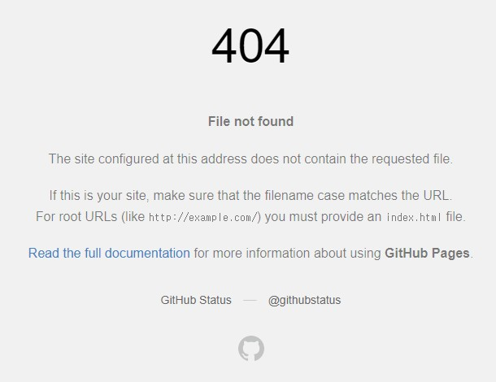

Tistory 블로그를 운영하다가 최근에 Velog로 마크다운을 사용해서 처음 포스팅을 해봤다.
마크다운을 사용하니 정보를 규칙적으로 나열할 수 있다는 점이 좋았고, 어느정도 시맨틱하게 포스팅을 작성할 수 있어서 SEO에도 좋을 것 같았다.
하지만 마크다운으로 작성하다보니 오히려 욕심이 생기면서 직접 블로그를 만들고 싶어졌다.
생각의 과정은 아래와 같다.

- Tistory
  - 장점: 자유롭게 커스텀이 가능하다. 그래서인지 아늑한 내 공간이라는 느낌이 있다.
  - 단점: 마크다운 미리보기 기능을 지원하지 않는다.
- Velog
  - 장점: 마크다운 미리보기 기능을 지원하고 단축키도 어느정도 지원한다.
  - 단점: 내 공간이라는 느낌보다는 SNS같은 느낌이 썩 좋진 않았다. 마크다운으로 작성하다보니 단축키를 더 자유롭게 쓰고 싶었고, 간격 조정과 같은 세부 스타일도 조정하고 싶었다.
- GitHub Pages블로그
  - 장점: 내 입맛에 맞게 설정해놓은 에디터 단축키를 자유롭게 쓸 수 있고 원하는대로 커스텀 가능하다는게 가장 큰 이유다. 걍 불가능한게 없다.
  - 단점: 학습 시간이 필요하고 제작 시간이 걸린다.

찾아보니 jekyll을 이용해 간단하게 GitHub Pages블로그를 만들 수 있었다. 하지만 목적이 생긴김에 직접 Vue3로 블로그를 만들어 보면 도움도 되고 재밌을 것 같았다.

- - -
## 프로젝트 생성
Vue3 프로젝트를 생성했다.
```
$ vue create yemsu.github.io
```
GitHub에 repository를 생성하고 remote add 해주었다.
```
$ git remote add origin https://github.com/sssjsjj/yemsu.github.io.git
```
생성된 프로젝트 'init'으로 첫 커밋을 하고 푸쉬했다.
- - -
## 폴더 구조 잡기
[[Vue] 🌱우아한 프로젝트 구조 짜기](https://velog.io/@cindy-choi/Vue-%EC%9A%B0%EC%95%84%ED%95%9C-%ED%94%84%EB%A1%9C%EC%A0%9D%ED%8A%B8-%EA%B5%AC%EC%A1%B0-%EC%A7%9C%EA%B8%B0)를 참고했다.
```
src
  ㄴ assets
    ㄴ images
    ㄴ style
  ㄴ components
    ㄴ layout
  ㄴ contents
    ㄴ images
  ㄴ router
    ㄴ views
  ㄴ utils
  main.js
  App.vue
```
- - -
## 마크다운으로 입력한 컨텐츠를 HTML로 렌더링 시키기
마크다운으로 입력한 컨텐츠를 화면에 렌더링 시키는 방법에 대해서 먼저 고민했다.
[GitHub API](https://docs.github.com/en/rest/reference)에서 제공하는 기능을 사용하기로 했다. 해당 API를 사용하기 위해서는 
[@octokit/core](https://github.com/octokit/core.js#readme) 라이브러리 패키지를 설치해야한다.
```
yarn add @octokit/core
```
[@octokit/core](https://github.com/octokit/core.js#readme)와 [GitHub API](https://docs.github.com/en/rest/reference)를 보면서 쭉 따라해봤다.

1. 소스를 적용하기 전에 access token을 먼저 발급받아야 한다.
2. [Octokit 토큰 발급 페이지](https://github.com/settings/tokens/new?scopes=repo)로 이동해서  
**Note**에는 토큰 사용이 필요한 어플리케이션 이름을 입력하고,  
**Expiration**은 30days로 되어있었는데 그때마다 재생성하긴 귀찮아서 90days로 했다.    
**Scopes**는 쭉 읽어봤는데 딱히 필요없을 것 같고 나중에 수정이 가능할 것 같아서 default 체크 항목 그대로 토큰을 생성했다. 
<figure>
  
  <figcaption>위와 같이 정보를 입력하고 Octokit 토큰을 발급 받았다</figcaption>
</figure>

3. 생성한 토큰을 아래와 같이 넣고 임시로 테스트 해볼 마크다운 텍스트로 html 변환 요청을 했다. 결과 값은 <code>htmlContents</code> 데이터 값에 저장하고 v-html 디렉티브에 값을 넣어 확인해봤다.
#### 📃 App.vue
```javascript
<template>
  <div v-html="htmlContents"></div>
</template>

<script>
import { Octokit  } from "@octokit/core";

export default {
  data() {
    return {
      htmlContents: null,
    }
  },
  async created() {
    const octokit = new Octokit({ auth: 생성한토큰 })

    const { data } = await octokit.request('POST /markdown', {
      text: `
## 마크다운으로 입력한 컨텐츠를 화면에 렌더링 시키는 방법
마크다운으로 입력한 컨텐츠를 화면에 렌더링 시키는 방법에 대해서 먼저 고민했다.
[GitHub API에서 제공하는 기능](https://docs.github.com/en/rest/reference/markdown)을 이용하면 되는 것 같았다.`
    })
    this.htmlContents = data
  },
}
</script>
```
4. html로 잘 들어간 것을 확인했다!
<figure>
  
  <figcaption>html로 잘 변환된 markdown</figcaption>
</figure>

- - -
## 마크다운 파일 컨텐츠 가져오기
작성된 파크다운 파일 하나를 vue파일 상단에서 import 해봤다.
```javascript
import text from "./contents/make-github-io-blog-with-vue3.md";
```
에러가 떴다.
```
Failed to compile.

./src/contents/make-github.io-blog-with-vue3.md 1:2
Module parse failed: Assigning to rvalue (1:2)
You may need an appropriate loader to handle this file type, currently no loaders are configured to process this file. See https://webpack.js.org/concepts#loaders
```
해당 파일 타입에 대한 로더를 설정해줘야 한다고 한다. 
[vue-markdown-loader](https://www.npmjs.com/package/vue-markdown-loader) 패키지를 설치했다.
```
yarn add vue-markdown-loader -D
``` 
vue.config.js 파일을 루트 경로에 생성하고
패키지 공식 가이드에서 **With Vue CLI3**에 대한 내용 그대로 넣었다.
#### 📃 vue.config.js
```javascript
module.exports = {
  chainWebpack: config => {
    config.module.rule('md')
      .test(/\.md$/)
      .use('vue-loader')
      .loader('vue-loader')
      .end()
      .use('vue-markdown-loader')
      .loader('vue-markdown-loader/lib/markdown-compiler')
      .options({
        raw: true
      })
  }
}
```
그래 에러야.. 안녕
```
[vue-loader] vue-template-compiler must be installed as a peer dependency, or a compatible compiler implementation must be passed via options.
```
vue-template-compiler 가 peer dependency로 꼭 깔려있어야 하거나 호환되는 컴파일러 실행을 옵션에 설정해줘야된다는 것 같다.  

<code>vue-template-compiler</code>는 vue2까지 사용하던 컴파일러이고 vue3 부터는 <code>@vue/compiler-sfc</code>를 설치해야한다고 한다.  

그래도 안된다. 더 찾아보니 <code>vue-markdown-loader</code> 자체가 vue3까지는 지원이 안된다고한다.
더 뒤져서  vue3까지 지원하는 [markdown-to-vue-loader](https://www.npmjs.com/package/markdown-to-vue-loader?activeTab=dependencies)를 찾았고 가이드 대로 vue config파일을 작성했다.
#### 📃 vue.config.js
```javascript
module.exports = {
  chainWebpack: config => {
    config.module.rule('md$')
      .test(/\.md/)
      .use('vue-loader')
      .loader('markdown-to-vue-loader')
      .end()
  },
}
```
그리고 에러를 또 만났다.
```
Syntax Error: TypeError: this.getOptions is not a function
```
호환되지 않는 패키지 일때 뜨는 에러라고 한다.  
구글링으로 원하는 패키지를 찾기가 많이 힘들다. 생각해보니 npm 공식 사이트에서 서치해보는게 훨씬 정확할 것 같았다. 그렇게 찾은 [@mdx-js/loader](https://www.npmjs.com/package/@mdx-js/loader).
설치를하고 공식문서대로 loader 설정했다.
```javascript
module.exports = {
  chainWebpack: config => {
    config.module
      .rule('mdx')
      .test(/\.mdx?$/)
      .use('babel-loader')
        .loader('babel-loader')
        .options({plugins: ['@vue/babel-plugin-jsx'], /* Other options… */})
        .end()
      .use('@mdx-js/loader')
        .loader('@mdx-js/loader')
        .options({jsx: true, /* otherOptions… */})
        .end()
  },
}
```
역시 계속 에러 떠서 공식문서도 보고 구글링도 하면서 오만 삽질하다가 생각해보니까 md파일 로더가 꼭 필요한건 아니고 md파일 내용을 그냥 String으로 가져와서 Octokit에 마크다운 문법에 따라 html로 변환해달라고 요청하면 되는거였다.
텍스트 파일 로더인 Webpack raw loader를 알게 됐고, Octokit은 기능이 많고 복잡한데 반해 나는 html로 변환만 우선 필요한거라 Octokit을 삭제하고 마크다운을 html로 변환해주는 기능만 해주는 패키지를 설치했다.
자세한 과정은 [Vue CLI 4 마크다운 파일을 불러와 HTML로 변환하기](vue-cli-4-import-markdown-convert-to-html)에 정리해두었다.

- - -
## Vue3 동적 라우팅 적용
라우터를 설치/설정 한다. 자세한 과정은 ["Vue3 Router 사용하기  (+ 동적 라우팅)](vue3-router)에서!

이제 <code>$route.params.title</code>값을 이용하여 원하는 마크다운 파일을 불러들이도록 작업해보자.

- - -
## 포스트 리스트 만들기
md파일들 자동으로 불러오고 싶었다.
node.js의 fs모듈로 파일 목록을 불러올 수 있어서 이렇게 저렇게 해보았는데
DB설정까지 해줘야해서 새로 공부할게 생각보다 훨씬 많았다.
작업이 많이 복잡한 듯 해서 우선은 파일리스트를 직접 작성하고, 파일 리스트 자동으로 가져오는 기능은 우선순위를 뒤쪽으로 뒀다.

list를 그릴때 사용할 post 데이터를 아래와 같은 형식으로 만들었다.
내용이 점점 많아질테니 컴포넌트에서 import할 시간을 절약하기 위해 string으로 변환해서 export했다.
#### 📃 src/utils/posts.js
``` javascript
const posts = [
  {
    'name': 'markdown-file-name',
    'title': 'title',
    'date': '2022-02-27',
    'keywords': ['keywords0', 'keywords1', 'keywords2'],
    'description': 'description',
  }
]

export default JSON.stringify(posts)
```

만들어놨던 데이터를 import해서 json으로 parse한 후에 데이터 바인딩했다.

#### 📃 src/router/views/PostList.vue

```html
<template>
  <div>
    <div
      v-for="(post, i) in postMap"
      :key="`post${i}`"
    >
      <a :href="post.name">
        {{ post.title }}
        {{ post.date }}
        {{ post.description }}
      </a>
      <ul>
        <li
          v-for="(keyword, keywordIndex) in post.keywords"
          :key="`keyword${keywordIndex}`"
        >
          {{ keyword }}
        </li>
      </ul>
    </div>
  </div>
</template>

<script>
import posts from '@/utils/posts'

export default {
  data() {
    return {
      postMap: []
    }
  },
  created() {
    this.postMap = JSON.parse(posts)
  },
}
</script>
```
- - -
## sass 설치 하기
이제 스타일들을 적용해준다.  

<coede>css</coede> 전처리기인 <coede>sass</coede>를 사용하기 위해 패키지를 설치해준다.
자세한 과정은 [이 포스팅](vue-cli-working-with-sass)에서!

- - -
## 폰트 설정
폰트는 [Github](https://github.com/)의 [Pretendard](https://github.com/orioncactus/pretendard)를 사용한다.  
웹에서 너무 부드럽게 잘 나온다. 어느 페이지든 이 폰트로 디자인의 완성도가 높아보이는 효과가 있다.  
<code>common.scss</code> 상단에 아래와 같이 font를 import하고 지정해준다.

```css
@import url('https://cdn.jsdelivr.net/gh/orioncactus/pretendard/dist/web/static/pretendard-dynamic-subset.css');

body {
  font-family: 'Pretendard';
}
```
- - -
## header 만들기
<code>header</code> 컴포넌트를 만들었다.  
로고랑 깃헙링크도 컴포넌트로 만들어서 <code>header</code> 컴포넌트 내부에 삽입해줬다.

## 📃 /src/components/layout/Header.vue
```html
<template>
  <header>
    <h1><Logo :size="'medium'" /></h1>
    <div class="links">
      <LinkGithub />
    </div>
  </header>
</template>

<script>
import Logo from '@/components/Logo.vue'
import LinkGithub from '@/components/LinkGithub.vue'

export default {
  components: {
    Logo,
    LinkGithub
  },
  data() {
    return {
    }
  }
}
</script>

<style lang="scss" scoped>
header {
  display: flex;
  align-items: center;
  justify-content: space-between;
  padding: 50px 50px 30px;
}
nav {
  ul {
    display: flex;
    gap: 20px;
  }
}
</style>
```

로고 컴포넌트는 <code>props</code>값을 받아서 사이즈를 지정할 수 있도록했다.  
우선은 <code>header</code>에서 필요한 사이즈만 지정하고 추후 다른 사이즈가 필요하게 되면 사이즈 옵션을 추가할 예정이다.

#### 📃 src/components/Logo.vue
```html
<template>
  <a href="/" :class="`logo size-${size}`">
    <span class="logo-text dev">
      D<span class="hidden">E</span>V
    </span>
    <span class="logo-text enjoy">
      <span class="common-e">E</span>NJOY🌊
    </span>
  </a>
</template>

<script>
export default {
  props: {
    size: {
      type: String,
      default: 'medium'
    }
  }
}
</script>

<style lang="scss" scoped>
.logo {
  display: block;
  position: relative;
  font-weight: 500;
  transform: rotate(-18deg);
  &.size-medium {
    font-size: 20px;
  }

  .emoji-main {
    font-size: 50px;
  }
  .logo-text {
    &.dev {
      margin-top: -1.05em;
      margin-right: -1.1em;
      writing-mode: vertical-rl;
      text-orientation: upright;
    }
    &.enjoy {
      letter-spacing: 0.1em;
      color: rgb(111, 0, 255);
    } 
    .hidden {
      color: #fff;
    }
  }
}
</style>


```
- - -
## 배포해서 확인 해보기
포스팅을 임시로 올려놓고 배포해보았다.  
메인페이지에 리스트는 잘 나온다.

<figure>
  
  <figcaption>블로그 메인 페이지 version 1 </figcaption>
</figure>


임시로 올려놓은 포스팅을 클릭해서 상세 페이지를 들어가봤더니 404 에러가 뜬다.
아 md파일은 static파일이라 다르게 해줘야 하는건가!  
webpack loader설정을 했으면 되는거 아닌가 싶었는데..

<figure>
  
  <figcaption>404에러가 뜨고있는 포스트 상세 페이지</figcaption>
</figure>

static파일들을 public폴더로 바꿔봤다가 history mode에 대한 설정도 변경해봤다가 post관련 
구글링을 죽어라 했지만 여전히 404에러가 날 반겼다.  
생각해보니까 static 파일 import에 문제가 있는 거였으면 404가 아니라 헤더는 떴어야했다.  
그래서 라우터에 404에러에 대한 오만가지 글들을 찾아보다가 갑자기 내가 포스트 리스트에 링크를 router link로 하지않고 a태그로 했다는 사실이 생각났다.^^  
a태그를 router link로 변경하니까 너무너무 잘 나왓다.  

<figure>
  
  <figcaption>html로 잘 불러와진 마크다운 컨텐츠</figcaption>
</figure>

허무하다... 삽질의 끝이란 ㅎ  
router의 history mode의 단점인 해당 url로 바로 갔을때 404에러가 뜨는 현상은 추후 개선해봐야겠다.  

- - -
## static 파일들은 public 폴더로
위 삽질 과정에서 또 새롭게 알게되어 static파일인 md, json파일들을 public 폴더로 옮겼다.
자세한 과정은 이 포스팅에!  
[Vue CLI 4 - 마크다운 파일을 불러와 HTML로 변환하기](vue-cli-4-import-markdown-convert-to-html)  

- - -
## HTTP 호출 모듈 만들기
두 페이지에서 axios로 http요청을 하고있다.  
비슷한 코드가 반복되어 http 요청과 관련된 내용을 모듈로 만들었다.
자세한 과정은 이 포스팅에!
[Vue - HTTP 호출 모듈 만들기](vue-make-http-module) 

##### 📃 src/router/views/Main.vue 
```html
<script>
// import axios from 'axios'  // as-is
import ContainerComp from '@/components/layout/Container.vue'
import PostList from '@/components/PostList.vue'
import { importPostsInfo } from '@/utils/https' // to-be

export default {
  components: {
    ContainerComp,
    PostList
  },
  data() {
    return {
      posts: [],
      // as-is
      // baseUrl: process.env.VUE_APP_BASE_URL,
    }
  },
  created() {
    // as-is
    // axios.get(`${this.baseUrl}/posts/index.json`)
    //   .then(res => this.posts = res.data)
    //   .catch(e => console.log(`ERROR🙄 ${e.response.status} : ${e.request.responseURL}`))
    
    // to-be
    importPostsInfo()
      .then(data => this.posts = data)
  }
}
</script>
```

### 검색 엔진에 등록하기
어느정도 기본 틀이 잡혔으니 검색엔진에 블로그를 등록해보려고 한다.

아래 블로그를 보고 진행하였다!
<cite>[워드퍼블 - 구글 블로거 네이버 웹마스터 도구 등록](https://wordpubl.com/%EA%B5%AC%EA%B8%80-%EB%B8%94%EB%A1%9C%EA%B1%B0-%EB%84%A4%EC%9D%B4%EB%B2%84-%EC%9B%B9%EB%A7%88%EC%8A%A4%ED%84%B0-%EB%8F%84%EA%B5%AC-%EB%93%B1%EB%A1%9D/)</cite>

#### 네이버
[네이버 Search Advisor](https://searchadvisor.naver.com/)에 접속


vuepress도 시도, nuxt에 대해서도 알아봤으나
규모가 크지않고 정적인 웹사이트에 사용할 용도라 prerenderer, vue-meta사용하기로 결정.
prerenderer셋팅하고.
sitemap 생성기로 vue-cli-plugin-sitemap 적용하려고함.
그런데 routes를 가져와서 써야해서
router 내부에 routes를 es모듈로 분리하고
vue.config.js에서 불러오려고 하는데 esm이 commonjs방식에서 호출이 안되는것같음 
Unexpected token 'export' 이란 에러가 뜸. (require = require('esm')(module);)
가이드 방식이 옛날껀가..?
좀더 알아보다가. vue-router-sitemap을 알게됐고 star수도 더 많다.
이것도 안됨.
vue-cli-4라서 그런지 관련 문서나 패키지가 많이 없다.
확실히 리액트는 패키지나 문서도 훨씬 많구나.
구글링 하다가 vue가 아닌 webpack 플러그인으로 sitemap.xml생성기가 있다. 좀더 세부적으로 내용을 적어줘야하는것같긴하지만..?
테스트해봤고 생성이 잘 됐다.
https://stackoverflow.com/questions/68460745/adding-a-sitemap-to-a-vuejs-application

테스트를 위해 값을 직접 입력했지만 자동으로 끌어올 수 있게 리팩토링 해보자.

세상에 ㅠ_ㅠ
public에 있는 posts.json을 가져와서 prerender랑 sitemap에 가공된 값을 넘겨주려고 했다.
그런데 posts.json http콜로 가져와야 한다고 생각해서 온갖 삽질을 다했다.
왜 그렇게 생각했지? 진짜 뭐가 씌었었나보다.
build과정에 비동기가 들어가니까 모든 절차가 끝난뒤에 비동기 함수들이 실행됐다.
온갖 에러를 검색해보고 점점 나는 산으로 갔다.

그러다가 그냥 플러그인 적용 사례를 찾아보면 그 중에 하나는 동적으로 routes값을 삽입하지않겠나 하는 생각이 들었고 찾아보다가. 그것도 엄청 찾아보다가
우연히 json을 그냥 require로 가져오는 코드를 봤다.
그렇게 허무하게 코드는 잘 돌아갔다.
세상에 시작이 틀어져서 몇시간을 고민했는줄 모른다.

또 지금 해놓은 방식도 좋은 방식인지 잘 모르겠다.
후. 우선 포스팅이 추가되면 파일 하나만 수정하면 된다는것에 정말 감사하다 ㅠ_ㅠ


무턱대고 하고싶은거 하려니까 정말 삽질이 말도못한다.
이 방식대로 개발하는게 맞는건지도 의심된다.
강의를 먼저듣고 강의내용을 바탕으로 나만의 프로젝트를 만드는게 가장 효율적이려나..?

이제 vue-meta를 ! 이건 아마 금방 되지않을까!!!!!!

postDetail에 작업중.
https://pozafly.github.io/html/meta-tag-and-vue-meta/
e
대박.vue-meta는 vue2까지만 된단다 열심히 해놓고보니까안됨
vue-3-meta로 버전3용은 따로 있다.
https://www.npmjs.com/package/vue-3-meta

그런데 설치는 vue-meta로 똑같다.
vue-meta로 메타태그적용하려고 하였으나 데이터를 불러온 후 데이터값 삽입이 안됐다.
(자세한 내용 vue-meta 포스팅)

며칠동안 파도 안되길래 prerender 설정에서 뭔가 할 수 있지 않을까해서 찾아봤다.
https://mygumi.tistory.com/385
위 블로그 보고 적용했고 빌드해서 확인해보니 잘된다.

이모지 파비콘 등록했다
https://css-tricks.com/emoji-as-a-favicon/